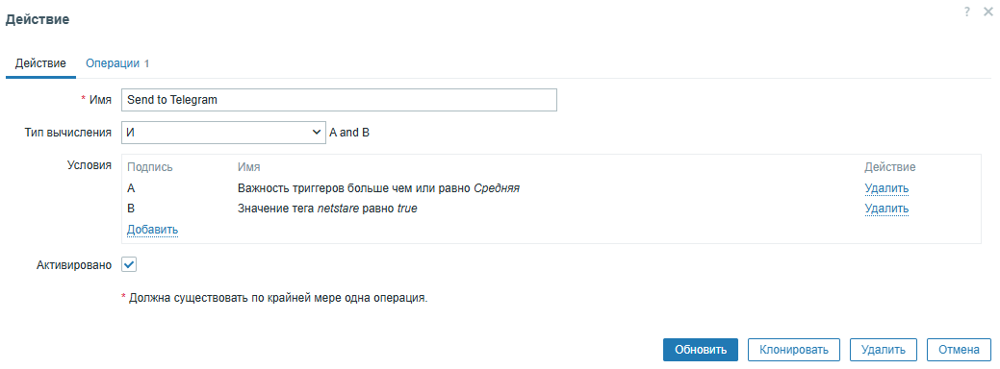
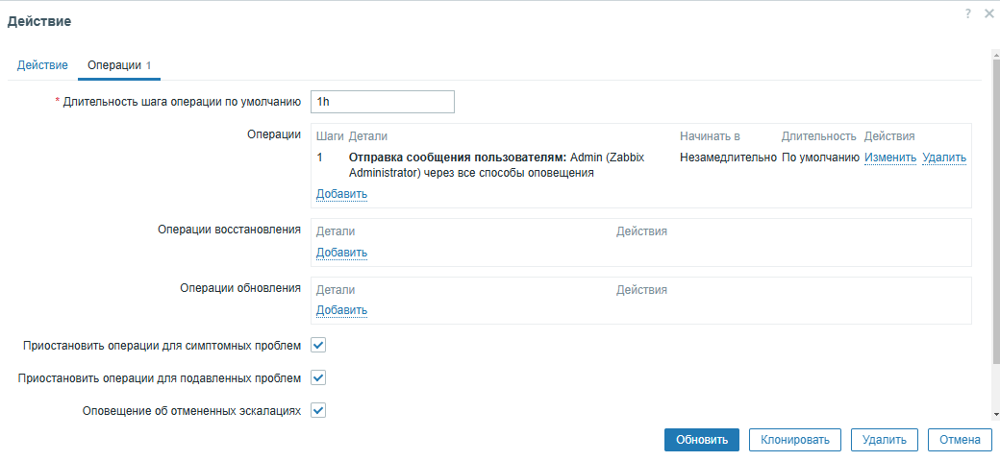
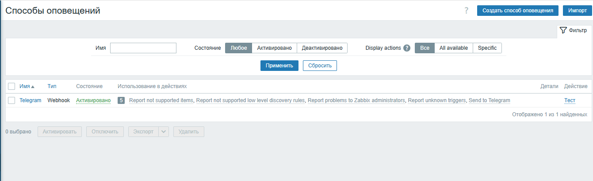
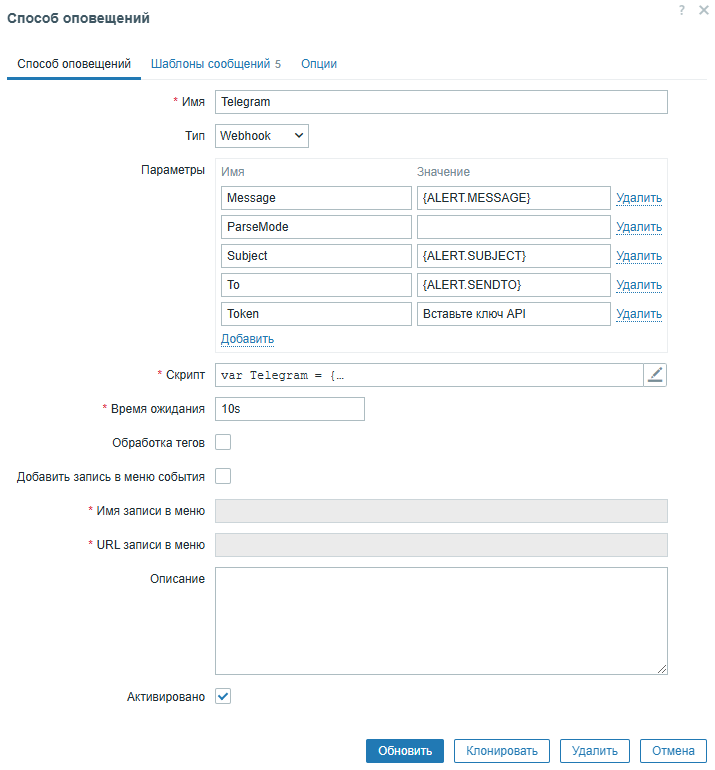

Подключение уведомлений на возникновение и восстановление проблемы
(отправка ботом сообщений в Telegram-группу)

1. По пути Оповещения -> Действия -> Действия триггеров:
(**Путь на веб** - *zabbix.php?action=action.list&eventsource=0*)

2. По пути Оповещения -> Способы оповещений -> Telegram:
(**Путь на веб** - *zabbix.php?action=mediatype.list*)
Задать скрипт, настройки и шаблоны, предоставленные вам менеджером

