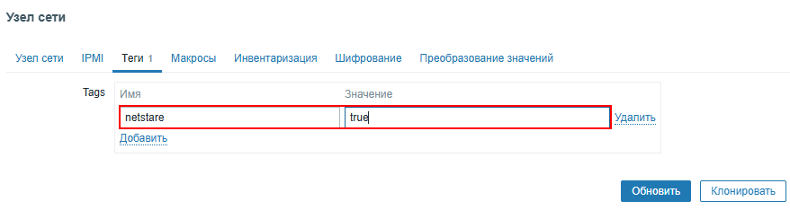
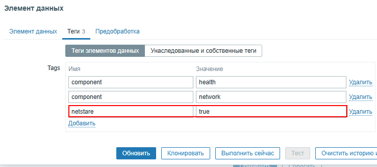

**NetStare** работает с системой Zabbix на следующих принципах:
{: .important-title }
> Принципы
>
> 1. Работа на основе ID
> 2. Для блока Устройств обрабатываются только непустые группы
> 3. Для блока Проблем обрабатываются только проблемные группы
> 4. Фильтрация узлов и элементов данных производится по наличию тега 'netstare': 'true'

